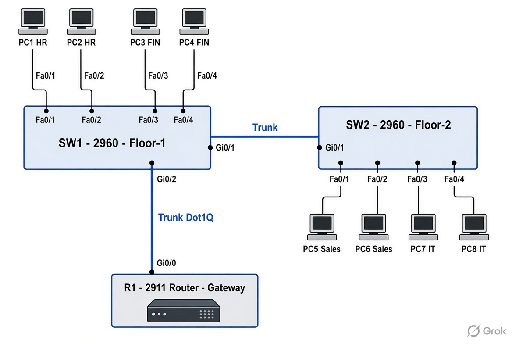

# Project 1: Enterprise LAN Switching & Inter-VLAN Routing - ABC Technologies

## 1. Objective
Design, configure and troubleshoot a multi-switch enterprise LAN with VLAN segmentation and Router-on-a-Stick inter-VLAN routing.

## 2. Business Scenario
ABC Technologies Pvt Ltd (Hyderabad) – 80 users across 4 departments (HR, Finance, Sales, IT) needed broadcast domain isolation and controlled inter-department communication.

## 3. Technologies Used
- Cisco Packet Tracer
- Cisco IOS 15
- VLAN, 802.1Q Trunking
- Router-on-a-Stick (subinterfaces)
- ARP, ICMP
- NOC Troubleshooting Methodology

## 4. Network Topology


**Devices:**
- 1 × Cisco 2911 Router
- 2 × Cisco 2960 Switches
- 8 × PCs

## 5. IP Addressing Plan
| Device | Interface / VLAN | IP Address     | Subnet Mask   | Gateway       | Purpose              |
|--------|------------------|----------------|---------------|---------------|----------------------|
| R1     | G0/0.10          | 192.168.10.1   | 255.255.255.0 | N/A           | Gateway VLAN 10 HR   |
| R1     | G0/0.20          | 192.168.20.1   | 255.255.255.0 | N/A           | Gateway VLAN 20 FIN  |
| R1     | G0/0.30          | 192.168.30.1   | 255.255.255.0 | N/A           | Gateway VLAN 30 Sales|
| R1     | G0/0.40          | 192.168.40.1   | 255.255.255.0 | N/A           | Gateway VLAN 40 IT   |
| PC1    | Fa0              | 192.168.10.11  | 255.255.255.0 | 192.168.10.1  | HR User 1            |
| PC2    | Fa0              | 192.168.10.12  | 255.255.255.0 | 192.168.10.1  | HR User 2            |
| PC3    | Fa0              | 192.168.20.11  | 255.255.255.0 | 192.168.20.1  | Finance User 1       |
| PC4    | Fa0              | 192.168.20.12  | 255.255.255.0 | 192.168.20.1  | Finance User 2       |
| PC5    | Fa0              | 192.168.30.11  | 255.255.255.0 | 192.168.30.1  | Sales User 1         |
| PC6    | Fa0              | 192.168.30.12  | 255.255.255.0 | 192.168.30.1  | Sales User 2         |
| PC7    | Fa0              | 192.168.40.11  | 255.255.255.0 | 192.168.40.1  | IT User 1            |
| PC8    | Fa0              | 192.168.40.12  | 255.255.255.0 | 192.168.40.1  | IT User 2            |

## 6. VLAN Plan
| VLAN ID | VLAN Name | Department      | Network         | Gateway      | Ports         |
|---------|-----------|-----------------|-----------------|--------------|---------------|
| 10      | HR        | Human Resources | 192.168.10.0/24 | 192.168.10.1 | SW1 Fa0/1-2   |
| 20      | FINANCE   | Finance         | 192.168.20.0/24 | 192.168.20.1 | SW1 Fa0/3-4   |
| 30      | SALES     | Sales           | 192.168.30.0/24 | 192.168.30.1 | SW2 Fa0/1-2   |
| 40      | IT        | IT Support      | 192.168.40.0/24 | 192.168.40.1 | SW2 Fa0/3-4   |

## 7. Device Configuration
Full configurations are available in the `/configurations` folder.

## 8. Key Configurations (Summary)

**SW1 Access Ports:**
```cisco
interface range FastEthernet0/1-2
 switchport mode access
 switchport access vlan 10
interface range FastEthernet0/3-4
 switchport mode access
 switchport access vlan 20

Trunk Configuration:
ciscointerface GigabitEthernet0/1
 switchport mode trunk
 switchport trunk allowed vlan 10,20,30,40
Router-on-a-Stick (R1):
ciscointerface GigabitEthernet0/0.10
 encapsulation dot1Q 10
 ip address 192.168.10.1 255.255.255.0
